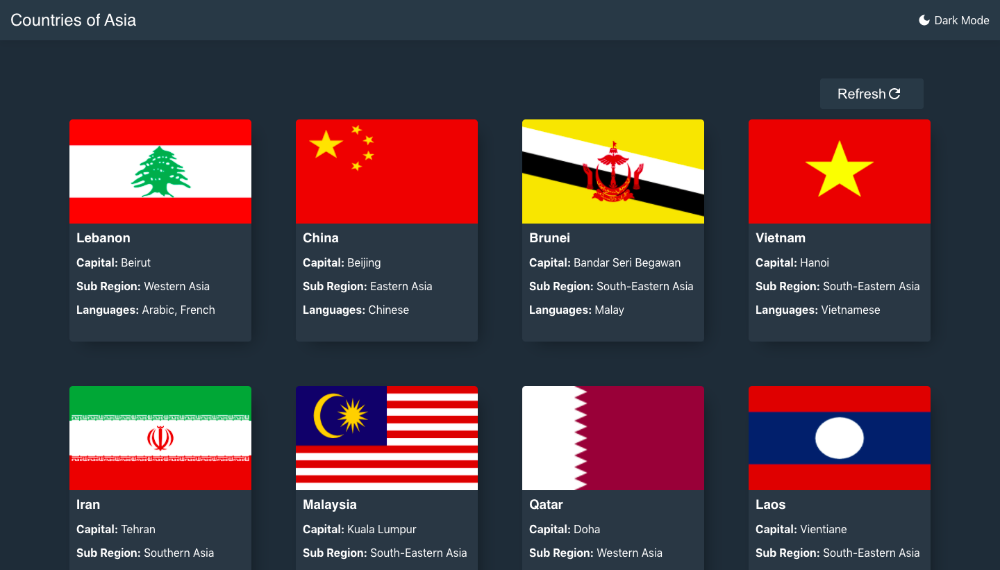
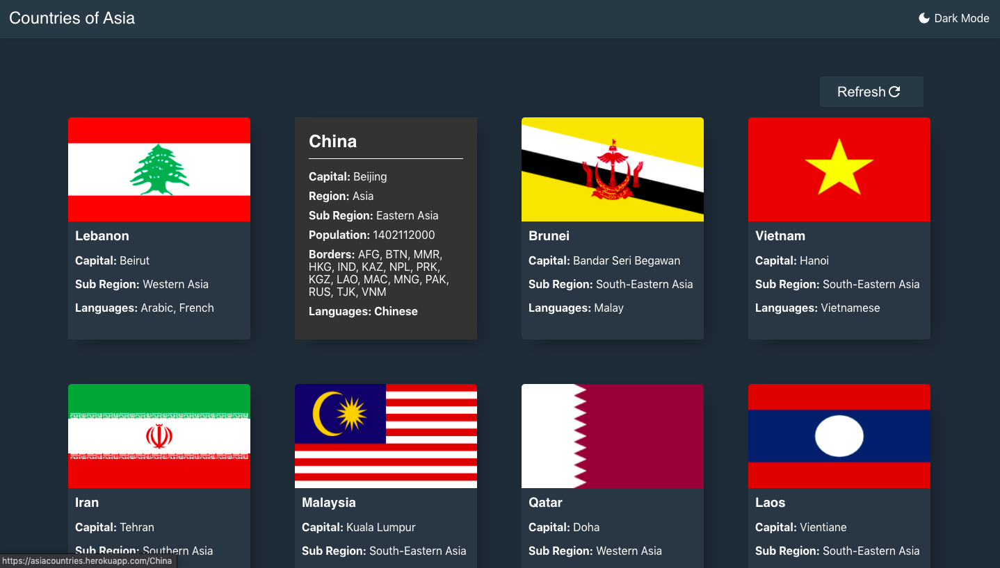
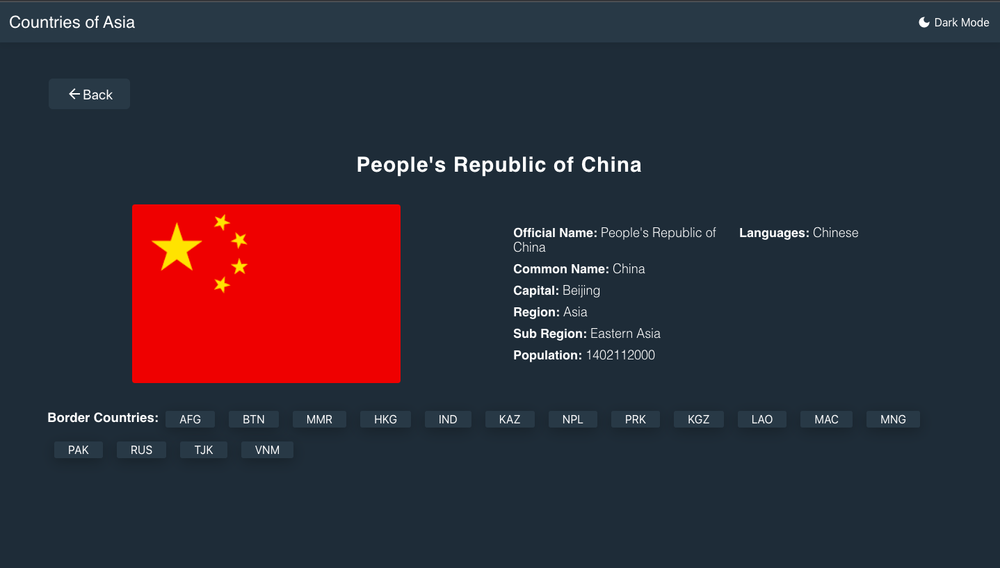

 Just Click  # [Here](https://asiacountries.herokuapp.com/)  you will be Navigate to the live version of app 
 




Built using React JS, Material UI Icons, Javascript, HTML, CSS  and for Backend Data I integrate Rest API (docs - https://restcountries.com/ )within day. 


## Features and Functionality

- List all countries of Asia on the homepage as a Card.
- When you hover on a card it will flip 180 and show you further details of Country on the back side of card.
- You can also see more detailed information on a separate page by clicking anywhere on the back side of card.
- There is a Refresh Button at Home page by which we can refresh REST API data.
- Mobile responsiveness


## How to build your own..?
1. Clone this repo
2. Install all the dependencies
   ```sh
    npm i
    ```
## Running The App

In the project directory, you can run:

```sh
npm start
```

Runs the app in the development mode. Open [http://localhost:3000](http://localhost:3000) to view it in the browser.

```sh
npm run build
```
## Yet to be implemented 

- Light mode
- Pagination
- Filter Country by name
**_NOTE: PLEASE LET ME KNOW IF YOU DISCOVERED ANY BUG OR YOU HAVE ANY SUGGESTIONS_**
